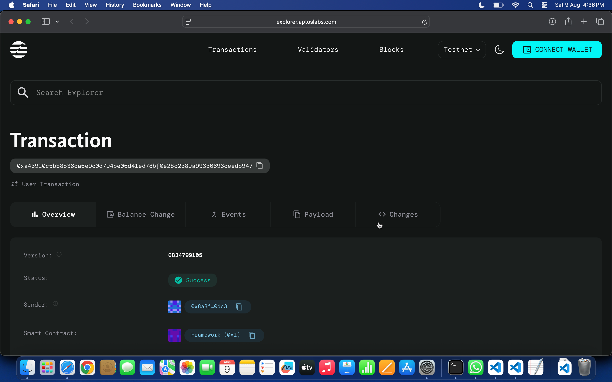

# Card Game Contract

## Project Title
**Decentralized Card Game with Verifiable Randomness**

## Project Description
A blockchain-based card game smart contract built on the Aptos network that implements a simplified version of Blackjack with verifiable randomness. Players can place bets, receive randomly generated cards, and compete against an automated dealer in a trustless environment. The contract ensures fair gameplay through on-chain randomness generation and transparent game mechanics.

## Project Vision
Our vision is to revolutionize online card gaming by creating a completely decentralized, transparent, and fair gaming ecosystem. We aim to eliminate the trust issues associated with traditional online casinos by leveraging blockchain technology to provide verifiable fairness, instant payouts, and complete transparency in game mechanics. This project represents the first step toward building a comprehensive decentralized casino platform where players have full confidence in the integrity of every game.

## Key Features

### 🎮 **Provably Fair Gaming**
- Utilizes blockchain timestamps and account sequences for verifiable randomness
- All game logic executed on-chain for complete transparency
- No hidden algorithms or manipulated outcomes

### 💰 **Secure Betting System**
- Integrated with Aptos Coin for seamless transactions
- Automatic bet deduction and payout distribution
- Smart contract holds funds during gameplay for security

### 🃏 **Simplified Blackjack Mechanics**
- Player receives two initial cards, dealer receives one
- Goal is to get as close to 21 without going over
- Dealer automatically draws cards following standard rules (hits until 17+)
- Face cards valued at 10 points

### ⚡ **Instant Settlement**
- Immediate game resolution and payout
- No waiting periods or manual intervention required
- Automated winner determination based on standard Blackjack rules

### 🔒 **Trustless Operations**
- No centralized authority controls game outcomes
- Smart contract automatically executes all game logic
- Players maintain full custody of their funds except during active games

## Future Scope

### Phase 1: Enhanced Game Features
- **Multiple Card Games**: Implement Poker, Baccarat, and other popular card games
- **Advanced Randomness**: Integration with Chainlink VRF for enhanced randomness
- **Ace Handling**: Proper Ace card logic (1 or 11 value optimization)

### Phase 2: Gaming Platform Expansion
- **Multi-Player Tables**: Enable multiple players to play simultaneously
- **Tournament Mode**: Organize tournaments with prize pools
- **Progressive Jackpots**: Implement accumulating jackpot systems

### Phase 3: Advanced Features
- **NFT Integration**: Unique card designs and special game modes
- **Governance Token**: Community-driven platform decisions
- **Mobile App**: Native mobile application for better user experience

### Phase 4: Ecosystem Development
- **Casino Hub**: Expand to include slot machines, roulette, and dice games
- **Social Features**: Friend systems, leaderboards, and achievements
- **Cross-Chain Support**: Deploy on multiple blockchain networks

## Contract Details
0x42b6bbac6fc91032dd1bb2b4263b96ff31b679abf5df617a4f78b7b8bf670dc9

